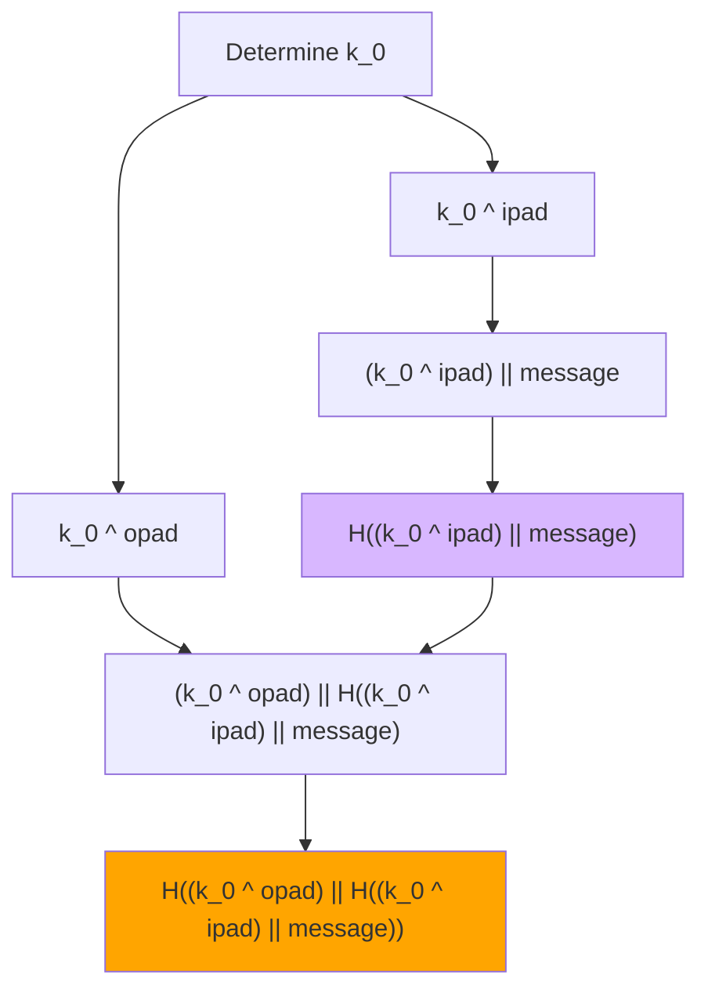

# HMAC-SHA256 in o1js

An implementation of provable HMAC-SHA256 in o1js.

> ⚠️ **NOTE**: This implementation currently only supports key and message sizes that are exactly equal to the SHA-256 block size (64 bytes/512 bits). Key/message padding and truncation are not yet implemented.

## HMAC Construction

The implementation follows the standard HMAC construction:

```
HMAC(K,m) = H((k_0 ^ opad) || H((k_0 ^ ipad) || m))
```

where:

- k_0 is the input key
- ipad is the inner padding (0x36363636 repeated)
- opad is the outer padding (0x5c5c5c5c repeated)
- H is SHA2_256 hash function
- || denotes concatenation
- ^ denotes XOR operation

## HMAC Diagram



## Usage

### Build

```sh
npm run build
```

### Run Example

```sh
npm run example
```

### Run Tests

```sh
npm run test
npm run testw # watch mode
```

### Run Coverage

```sh
npm run coverage
```

## Circuit Constraints

_For key and message size of 64 bytes (512 bits)_

| Constraint Type | Count |
| --------------- | ----- |
| Total rows      | 25294 |
| Generic         | 7692  |
| EndoMulScalar   | 7630  |
| Xor16           | 6648  |
| Zero            | 3324  |

## References

- [RFC 2104: HMAC - Keyed-Hashing for Message Authentication](https://datatracker.ietf.org/doc/html/rfc2104)
- [RFC 4231: HMAC-SHA Test Cases](https://datatracker.ietf.org/doc/html/rfc4231)
- [FIPS 198-1: The Keyed-Hash Message Authentication Code (HMAC)](https://csrc.nist.gov/files/pubs/fips/198/final/docs/fips-198a.pdf)

## License

[Apache-2.0](LICENSE)
