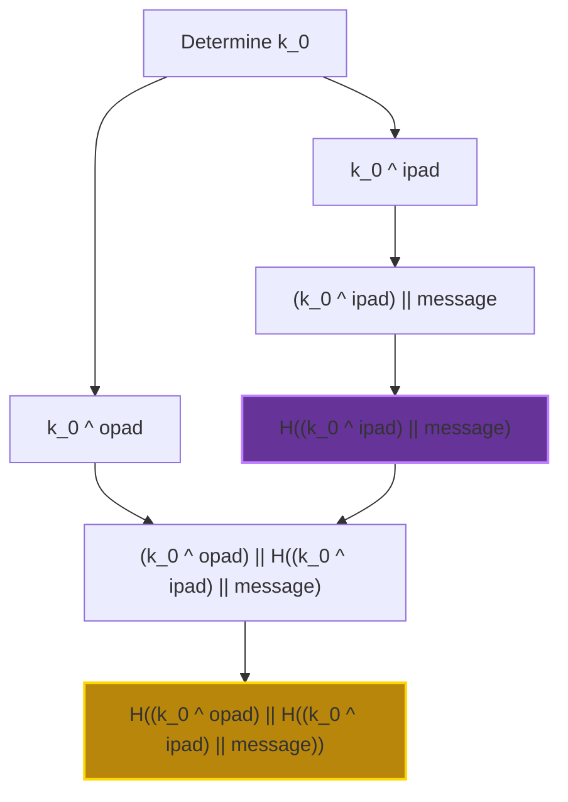

# HMAC-SHA256 in o1js

An implementation of provable HMAC-SHA256 in o1js.

## HMAC Construction

The implementation follows the standard HMAC construction:

```
HMAC(K,m) = H((k_0 ^ opad) || H((k_0 ^ ipad) || m))
```

where:

- k_0 is the input key
- ipad is the inner padding (0x36 repeated)
- opad is the outer padding (0x5c repeated)
- H is SHA2_256 hash function
- || denotes concatenation
- ^ denotes XOR operation

## HMAC Diagram



## Usage

### Build

```sh
npm run build
```

### Run Example

```sh
npm run example
```

### Run Tests

```sh
npm run test
npm run testw # watch mode
```

### Run Coverage

```sh
npm run coverage
```

### Run Benchmark
```sh
npm run benchmark
```

## Circuit Constraints

_For key and message size of 64 bytes (512 bits)_

| Constraint Type | Count |
| --------------- | ----- |
| Total rows      | 25310 |
| Generic         | 7708  |
| EndoMulScalar   | 7630  |
| Xor16           | 6648  |
| Zero            | 3324  |

## Circuit Constraints - [RFC 4231](https://datatracker.ietf.org/doc/html/rfc4231) Test Cases

This section documents the circuit constraints for each test case from RFC 4231.

| Test Vector | Constraints | Message Length (n) | Key Length (k) | Execution Time (s) |
|-------------|-------------|-------------------|----------------|-------------------|
| 1           | 21,136      | 8                 | 20             | 1.318            |
| 2           | 21,214      | 28                | 4              | 0.841            |
| 3           | 21,475      | 50                | 20             | 0.863            |
| 4           | 21,504      | 50                | 25             | 0.884            |
| 5           | 21,229      | 20                | 20             | 0.799            |
| 6           | 37,228      | 54                | 131            | 1.511            |
| 7           | 47,859      | 152               | 131            | 2.291            |

_Tests performed on a MacBook Pro with M4 Pro chip and 24GB RAM with Node.js v22.12.0_

## References

- [RFC 2104: HMAC - Keyed-Hashing for Message Authentication](https://datatracker.ietf.org/doc/html/rfc2104)
- [RFC 4231: HMAC-SHA Test Cases](https://datatracker.ietf.org/doc/html/rfc4231)
- [FIPS 198-1: The Keyed-Hash Message Authentication Code (HMAC)](https://csrc.nist.gov/files/pubs/fips/198/final/docs/fips-198a.pdf)

## License

[Apache-2.0](LICENSE)
